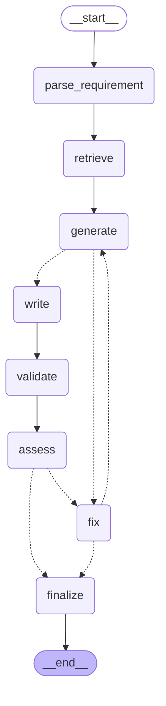

# 当前 LangGraph 流程图

由 `build_graph().get_graph().draw_mermaid()` 生成，实线为固定边，虚线为条件边。

```mermaid
graph TD;
	__start__([<p>__start__</p>]):::first
	parse_requirement(parse_requirement)
	retrieve(retrieve)
	generate(generate)
	write(write)
	validate(validate)
	assess(assess)
	fix(fix)
	finalize(finalize)
	__end__([<p>__end__</p>]):::last
	__start__ --> parse_requirement;
	assess -.-> finalize;
	assess -.-> fix;
	fix -.-> finalize;
	fix -.-> generate;
	generate -.-> fix;
	generate -.-> write;
	parse_requirement --> retrieve;
	retrieve --> generate;
	validate --> assess;
	write --> validate;
	finalize --> __end__;
	classDef default fill:#f2f0ff,line-height:1.2
	classDef first fill-opacity:0
	classDef last fill:#bfb6fc
```
